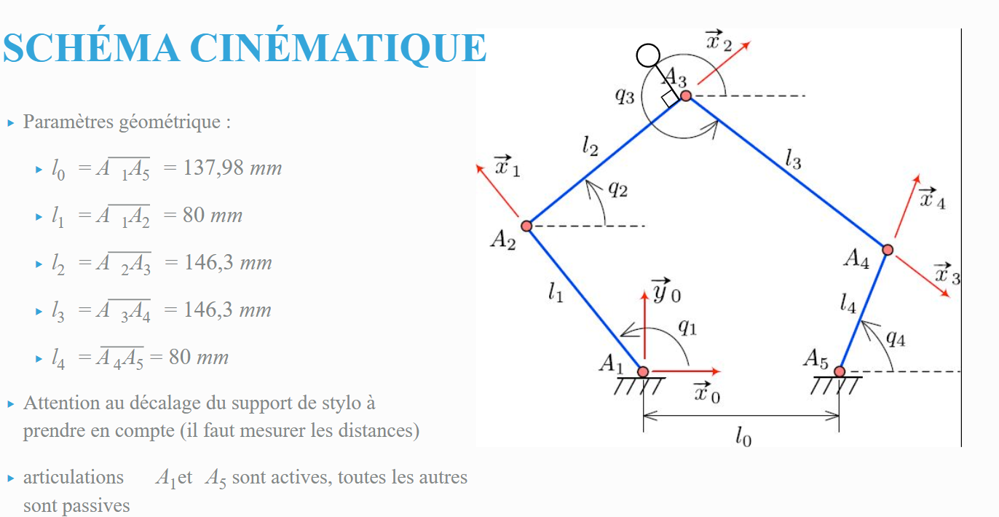

Modèle Géométrique
==================

Pour piloter le robot, nous devons traduire une position cartésienne cible (X, Y) en angles moteurs. C'est le rôle du **Modèle Géométrique Inverse (MGI)**.

Schéma Cinématique
------------------
    Le robot est une structure parallèle de type "Five-Bar". Voici les paramètres géométriques et les repères définis pour la modélisation :

Paramètres du Code
~~~~~~~~~~~~~~~~~~

Le script de contrôle Python intègre les dimensions exactes mesurées sur la CAO  :

* **Bras Gauche (Left Arm -** :math:`A_1 \to A_2 \to P` **)** :
    * Position Moteur (:math:`A_1`) : :math:`x = -0.08m, y = -0.07m`
    * Longueur :math:`L_1` : :math:`0.080m`
    * Longueur :math:`L_2` : :math:`0.157m`

* **Bras Droit (Right Arm -** :math:`A_5 \to A_4 \to P` **)** :
    * Position Moteur (:math:`A_5`) : :math:`x = 0.058m, y = -0.07m`
    * Longueur :math:`L_1` : :math:`0.079m`
    * Longueur :math:`L_2` : :math:`0.147m`

Résolution Mathématique (MGI)
-----------------------------

    La fonction ``solve_arm_ik`` du script découpe le problème en deux chaînes articulées indépendantes (RR : Rotoïde-Rotoïde). Pour chaque bras, nous formons un triangle entre le moteur, le coude et la cible.

    Nous utilisons le **Théorème d'Al-Kashi** (Loi des cosinus) pour trouver les angles articulaires.

    1.  **Calcul de la distance et de l'angle global** :
        On calcule le vecteur entre le moteur et la cible :math:`(dx, dy)` et la distance :math:`D`.

        .. math::

            D = \sqrt{dx^2 + dy^2}

        .. math::

            \alpha = \arctan2(dy, dx)

    2.  **Calcul de l'angle moteur** (:math:`\theta_{motor}`) :
        L'angle interne :math:`\beta` du triangle au niveau du moteur est donné par :

        .. math::

            \cos(\beta) = \frac{L_1^2 + D^2 - L_2^2}{2 \cdot L_1 \cdot D}

        L'angle final du moteur dépend de la configuration du coude (signe de :math:`\beta`) :

        .. math::

            \theta_{motor} = \alpha + (\text{config} \times \beta)

    3.  **Calcul de l'angle du coude** (:math:`\theta_{elbow}`) :
        Bien que passif en réalité, cet angle est calculé pour la simulation afin de fermer la chaîne cinématique.

        .. math::

            \cos(\gamma) = \frac{L_1^2 + L_2^2 - D^2}{2 \cdot L_1 \cdot L_2}

        .. math::

            \theta_{elbow} = \gamma

Script de Contrôle (Python)
---------------------------

Ce script ROS 2 implémente la logique ci-dessus. Il inclut également :

* Une interpolation linéaire pour lisser les mouvements.
* Des vérifications de sécurité (limites angulaires et portée maximale).
* La publication des commandes pour les 4 joints (2 moteurs + 2 coudes simulés).

.. code-block:: python
   :caption: scripts/five_bar_safe.py
   :linenos:

    #!/usr/bin/env python3
    import rclpy
    from rclpy.node import Node
    from std_msgs.msg import Float64MultiArray
    import math
    import threading
    import time

    # === PARAMETRES EXACTS (URDF) ===
    MOTOR_L_POS = (-0.08, -0.07) 
    L1_L = 0.080   
    L2_L = 0.157   

    MOTOR_R_POS = (0.058, -0.07)
    L1_R = 0.079   
    L2_R = 0.147   

    # === CONTRAINTES DE SECURITE ===
    R_MOT_MIN_DEG = 5.0   
    R_MOT_MAX_DEG = 114.0 

    # === PARAMETRES DE MOUVEMENT ===
    VITESSE_M_S = 0.05 
    FREQ_LOOP = 50.0    
    DT = 1.0 / FREQ_LOOP

    class FiveBarSafe(Node):
        def __init__(self):
            super().__init__('five_bar_safe')
            
            # Publication vers le contrôleur défini dans controllers.yaml
            self.publisher_ = self.create_publisher(
                Float64MultiArray, 
                '/forward_position_controller/commands', 
                10)
            
            # Position initiale sure
            self.curr_x = -0.01
            self.curr_y = 0.12 
            self.target_x = self.curr_x
            self.target_y = self.curr_y

            self.last_valid_cmd = [0.0, 0.0, 0.0, 0.0]
            
            self.timer = self.create_timer(DT, self.control_loop)
            
            # Thread séparé pour ne pas bloquer ROS avec l'input utilisateur
            self.input_thread = threading.Thread(target=self.user_input_loop)
            self.input_thread.daemon = True
            self.input_thread.start()
            
            self.get_logger().info(f"Démarrage sûr à X={self.curr_x}, Y={self.curr_y}")

        def solve_arm_ik(self, target_x, target_y, motor_x, motor_y, L1, L2, elbow_config):
            """
            Calcule la cinématique inverse pour un bras (Moteur -> Coude -> Cible)
            Utilise le théorème d'Al-Kashi.
            """
            dx = target_x - motor_x
            dy = target_y - motor_y
            dist = math.sqrt(dx*dx + dy*dy)
            
            # Vérification de portée (Workspace)
            if dist > (L1 + L2) or dist < abs(L1 - L2):
                return None, None 

            # Calcul de l'angle alpha (direction cible)
            alpha = math.atan2(dy, dx)

            # Calcul de l'angle beta (angle interne moteur) via Al-Kashi
            val_cos_beta = (L1**2 + dist**2 - L2**2) / (2 * L1 * dist)
            val_cos_beta = max(-1.0, min(1.0, val_cos_beta)) # Clamp pour éviter erreurs num.
            beta = math.acos(val_cos_beta)
            
            # Angle moteur final (dépend de la config coude haut/bas)
            theta_motor = alpha + (elbow_config * beta)

            # Calcul de l'angle gamma (angle interne coude) via Al-Kashi
            val_cos_gamma = (L1**2 + L2**2 - dist**2) / (2 * L1 * L2)
            val_cos_gamma = max(-1.0, min(1.0, val_cos_gamma))
            gamma = math.acos(val_cos_gamma)
            
            theta_elbow = gamma

            return theta_motor, theta_elbow

        def control_loop(self):
            # 1. Génération de trajectoire (Interpolation linéaire)
            dx = self.target_x - self.curr_x
            dy = self.target_y - self.curr_y
            dist_to_target = math.sqrt(dx*dx + dy*dy)
            step = VITESSE_M_S * DT
            
            next_x, next_y = self.curr_x, self.curr_y

            if dist_to_target > 0.001:
                if dist_to_target < step:
                    next_x, next_y = self.target_x, self.target_y
                else:
                    ratio = step / dist_to_target
                    next_x += dx * ratio
                    next_y += dy * ratio

            # 2. Calcul IK pour les deux bras
            # Note: elbow_config=1 pour gauche, -1 pour droite
            mot_L, elb_L = self.solve_arm_ik(
                next_x, next_y, MOTOR_L_POS[0], MOTOR_L_POS[1], L1_L, L2_L, 1
            )
            mot_R, elb_R = self.solve_arm_ik(
                next_x, next_y, MOTOR_R_POS[0], MOTOR_R_POS[1], L1_R, L2_R, -1
            )

            valid_move = True

            # Vérification validité solution
            if mot_L is None or mot_R is None:
                valid_move = False

            # Vérification limites moteur droit
            if valid_move:
                mot_R_deg = math.degrees(mot_R)
                if not (R_MOT_MIN_DEG <= mot_R_deg <= R_MOT_MAX_DEG):
                    self.get_logger().warn(f"LIMITE ANGLE : {mot_R_deg:.1f}°")
                    valid_move = False

            # 3. Envoi de la commande
            msg = Float64MultiArray()

            if valid_move:
                self.curr_x = next_x
                self.curr_y = next_y
                # Ordre: [Left_Mot, Right_Mot, Left_Elbow, Right_Elbow]
                # Notez le '-elb_R' pour corriger l'orientation du repère
                self.last_valid_cmd = [mot_L, mot_R, elb_L, -elb_R]
                msg.data = self.last_valid_cmd
            else:
                # Si mouvement invalide, maintien de la position (Torque ON)
                msg.data = self.last_valid_cmd
                if dist_to_target > 0.01:
                   self.target_x = self.curr_x # Reset target si bloqué
                   self.target_y = self.curr_y

            self.publisher_.publish(msg)

        def user_input_loop(self):
            time.sleep(1)
            print("\n--- CONTROLEUR SECURISE ---")
            while rclpy.ok():
                try:
                    print("Entrez cible X Y :")
                    in_x = input("  X > ")
                    in_y = input("  Y > ")
                    x_val = float(in_x)
                    y_val = float(in_y)
                    
                    if y_val < 0.0:
                        print("Refusé (Y < 0)")
                        continue
                    
                    self.target_x = x_val
                    self.target_y = y_val
                except ValueError:
                    print("Erreur de saisie.")

    def main(args=None):
        rclpy.init(args=args)
        node = FiveBarSafe()
        try:
            rclpy.spin(node)
        except KeyboardInterrupt:
            pass
        finally:
            node.destroy_node()
            rclpy.shutdown()

    if __name__ == '__main__':
        main()

